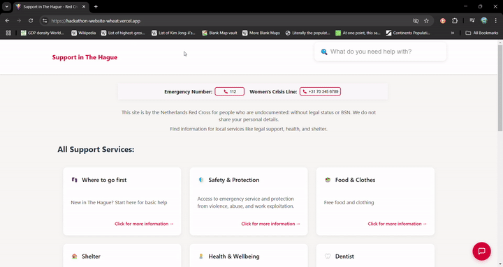

<!--
    ┏━━━━━━━━━━━━━━━━━━━━━━━━━━━━━━━━━━━━━━━━━━━━━━━━━━━━━━━━━━━━━━━━━━━━━━━━━━━━┓
    ┃                                                                            ┃
    ┃    RED CROSS INFORMATION ACCESS PLATFORM - README                          ┃
    ┃                                                                            ┃
    ┗━━━━━━━━━━━━━━━━━━━━━━━━━━━━━━━━━━━━━━━━━━━━━━━━━━━━━━━━━━━━━━━━━━━━━━━━━━━━┛
-->

<!-- Top Banner / Hero Image -->


<div align="center">
  
  
  
  
  <!-- Project Title -->
  <h1>Red Cross Information Access Platform</h1>
  
</div>

---

## Demonstration  

💻 **See our website** final product at [http://bit.ly/RedCrossHague](http://bit.ly/RedCrossHague)

📱 Chat with our **Telegram bot** at [this link](https://t.me/RedCrossHagueBot) to find the information you want

<!-- Make the phone number pop! -->
> ### **📞 HOTLINE**  
> ### **+31 970 102 500 66**  
> *(If the phone doesn't pick up then the fellow participants might be overloading the line, please try again later)*

---

## Table of Contents
1. [Overview](#overview)  
2. [Usage](#usage)  
3. [Features](#features)  
4. [Technical-Details](#technical-details)

---

## Overview
Imagine arriving in a new city, facing an unfamiliar language and needing urgent assistance.  
This is a problem that afflicts many people including refugees, asylum seekers and undocumented immigrants.  
The current interface is slow, not particularly accessible but still manages to be overwhelming.

Our project seeks to improve this experience by streamlining access to critical resources through a combination of intelligent navigation, UI revamp, and AI-driven support agents.  
Built for the Red Cross, this platform offers an intuitive interface and a multilingual chatbot backed by real-time information from a dynamic content management system (CMS).

---

## Usage

### Accessing the Website
Navigate to [website URL](http://bit.ly/RedCrossHague) to explore the demo. Key services such as shelter information and frequently asked questions are accessible directly from the homepage.

### Chatbot Interaction
- **Text-based:** Type questions directly into the chatbot interface.
- **Voice-based:** Dial +31 970 102 500 66 to speak to the chatbot and receive spoken responses via Twilio’s integration.

---

<!-- Centered GIF -->
<p align="center">
  
</p>

---

## Features

### 1. Simplified Website Structure, Revamped UI
- Reduced the number of clicks required to reach essential information.
- Cleaner navigation focused on high-priority, time-sensitive resources.

### 2. Search Bar
- Quickly find shelters, services, or other critical information without having to browse.

### 3. Conversational AI Chatbot
- Natural language interaction: Ask questions in your native language.
- Powered by **Retrieval-Augmented Generation (RAG)** for accurate responses, with data verified through Red Cross resources.

### 4. Multi-Channel Support
- For users who prefer direct communication, a **phone number** connects to the chatbot using Twilio’s speech processing integration.
- A Telegram bot can also reply with relevant info for users who prefer to text.

### 5. Automated and Updated CMS System
- Data integrity is maintained through an easy-to-use CMS that automatically updates the entire platform. Adding new content is fast, secure, and requires minimal effort.

---

<details>
  <summary><strong>Example: Running the Platform Locally</strong></summary>

```bash
# Clone the repository
git clone git@github.com:BeyondStandard/HackForGood-2025.git
cd HackForGood-2025/

# Setup the environment
python -m venv .venv
source .venv/bin/activate

# Rename GOOGLE_APPLICATION_CREDENTIALS and PROJECT_ID to point to your GCP project and host!
# You will need your own LLM, LangChain and Twilio credentials

# Install dependencies
pip install -r fastapi/requirements.txt
pip install uvicorn

# Voila! (https://github.com/desertbit/grml)
grml deploy locally 

# The website should now be accessible at http://localhost:8000
